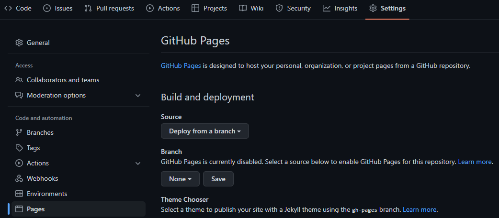
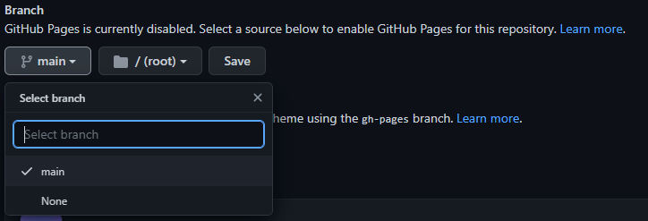

# Github Pages
Podemos usar o github como plataforma de hospedagem para arquivos estáticos (.html, .css, js...) de forma gratuita

 
Para hospedarmos uma página estática no github pages precisamos [subir os arquivos do nosso projeto](/usando_git_github/03_adicionando_arquivos.md) para um repositório do github.

# Como fazer

1. Na aba do repositório criado, vá em configurações (settings).


<br/>
<br/>

2. Após o passo acima, selecione a opção no menu vertical ``` Pages ``` 



<br/>
<br/>

3. No titulo ``` Branch ```, existe a opção que vem por padrão ``` None ```. Basta selecionar a  ``` Branch ``` que deseja. Agora clique em ``` Save ```.



<br/>
<br/>

4. Pronto! já está criado. Para ver o resultado acesse: ```nome-do-repositorio.github.io/projeto```


## Links
[Comandos Básicos](/introducao/03_comandos_basicos.md)
[Github](/usando_git_github/03_adicionando_arquivos.md)
