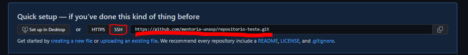

# Criando  Repositório

Antes de qualquer passo deve-se ter o GIT instalado e configurado em sua máquina. Acesse o passo abaixo para realizar a instalação e configuração do mesmo:

[Instalação e Configuração do Git](/introducao/02_instalacao_e_configuracao.md)

Após a instalação e configuração, crie uma conta no <a href="https://github.com/signup?ref_cta=Sign+up&ref_loc=header+logged+out&ref_page=%2F&source=header-home" target="blank" title="GitHub">GitHub</a>.

Assim que entrar em sua conta do GitHub aparecerá a tela abaixo (Sem esses repositórios que mostram na imagem):


# Conseguiu chegar até aqui?! Excelente!

O próximo passo é clicar no botão escrito  `New repository`.


Feito isso, será redirecionado para a página abaixo. Onde poderá escolher:
<ul>
    <li>Nome do repositório;</li>
    <li>Descrição, explicando mais sobre repositório;</li>
    <li>Se será publico ou privado;</li>
    <li>Com quais arquivos virá na pasta raiz na hora da criação.</li>
</ul>


Em seguida click no botão `Create repository` no final da página. Te redirecionando para a tela abaixo: 


<p style="font-size:25px;">Parabéns você criou seu primeiro repositório!!!</p>

# O que fazer agora?
Antes de criar repositórios, adicionar arquivos, remover, editar...
  
Aprenda [associar SSH key com GitHub](/usando_git_github/02_configurando_ssh_key.md).


# SSH associada com o GitHub? Então vamos clonar o repositório

Selecione `SSH` e copie a `url` gerada ao lado:



<br><br>

Feito Isso, abra seu cmd, git bash ou visual code terminal. Acesse o diretório de sua escolha e digite a seguinte linha de comando e pressione enter.

```sh
  git clone url-copiada-no-passo-acima
```

Pronto! seu repositório foi clonado em sua máquina.


