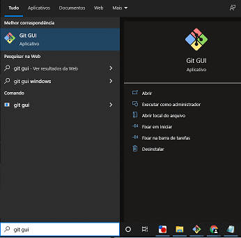
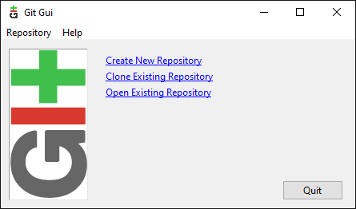
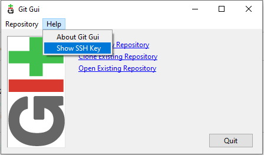
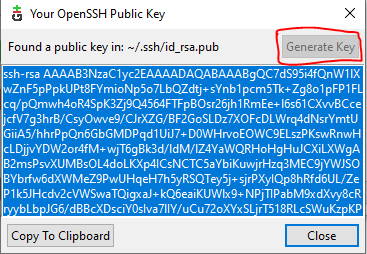
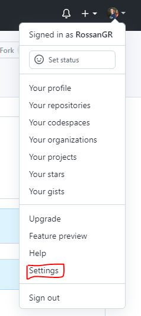
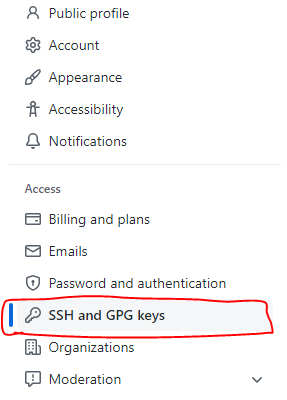
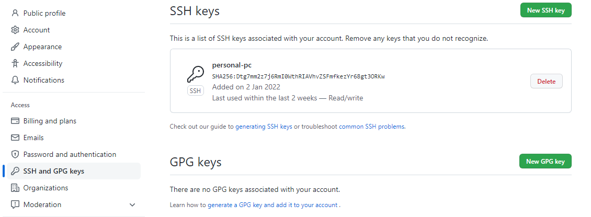
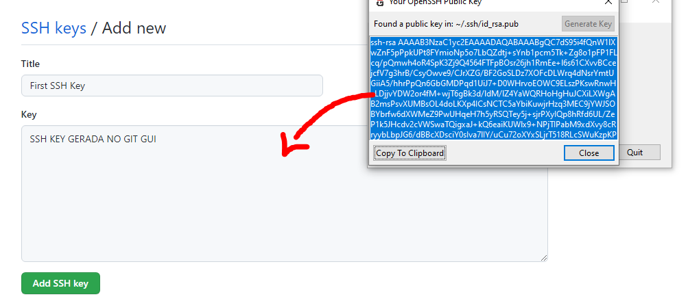

# Configurando SSH Key

Para adicionar aquivos em seu repositório, primeiramennte é necessário associar uma <a href="https://en.wikipedia.org/wiki/Ssh-keygen" target="blank" title="O que é SSH Key?">SSH Key</a>. 

Siga os passos abaixos para configurar sua SSH key

Na barra de tarefas no campo de pesquisa, procure por Git GUI. Caso não tenha o Git instalado em sua máquina [clique aqui](/introducao/02_instalacao_e_configuracao.md).
  

 
 
Após abrir o programa aparecerá a tela abaixo:

 
 

 1.Clique em `Help`   

  

2.Clique em `Show SSH key`  

  

3.Clique em `Generate Key`  

  

Copie tudo que estiver dentro deste retangulo (como mostra a imagem acima com fundo azul). Agora vamos associar essa chave no GitHub.

Parabéns você gerou sua SSH Key!!

# Associando SSH Key no GitHub

Com seu GitHub aberto vá em `Settings`
  

  
Depois procure `SSH and GPG keys`
  

  
Estamos quase Finalizando a associação da SSH Key. Realizado o passo acima essa tela aparecerá para você:
  

  

Clique em `New SSH Key`
  

  

Coloque um título de sua escolha para sua SSH Key. E logo abaixo no campo `Key`, cole a chave gerada no Git Gui (passo 3).

  

Feito isso, clique em `Add SSH key` abaixo do campo `Key`. E Pronto! sua SSH Key está associada ao seu GitHub.

# O que fazer Agora?

Agora sim estamos prontos para adicionar nossos arquivos no repositório que criamos.

[Adicionar Arquivos no repositório](/usando-git-github/03_adicionando_arquivos.md).  