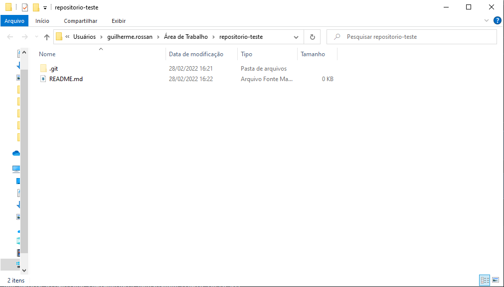
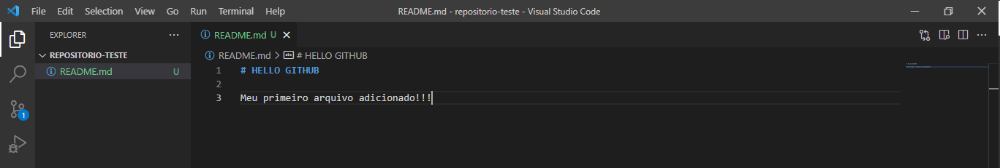
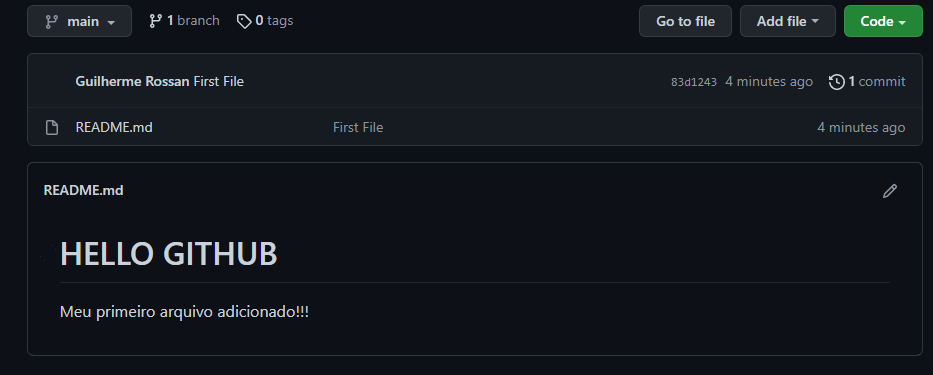

# Adicionando Arquivos

Após ter clonado o [repositório criado](/usando_git_github/01_criando_repositorio.md) em um diretório de sua escolha. Abra-o e crie o arquivo `README.md`


<br><br>

# Editando Arquivo
Em uma <a href="https://pt.wikipedia.org/wiki/IDLE" target="blank" title="o que é IDLE?">IDLE</a> de sua preferência procure e abra o arquivo `README.md`. Logo em seguida vamos preenchê-lo com alguma informação.


<br><br>

# Adicionando Arquivo Criado

Após o passo acima realizado, vamos commitar o novo arquivo criado.

Em seu cmd, git bash, visual code terminal. Digite as seguintes linhas de comando
<br><br>
Adiciona todos os arquivos criandos/modificados/removidos:
```sh
  git add .
```

Nome do commit referente ao(s) arquivo(s) criando(s)/modificado(s)/removido(s):
```sh
  git commit -m 'Fisrt File'
```

Empurra (adiciona) os arquivos para o repositório criado:
```sh
  git push 
```

Para facilitar, pode digitar essas três linhas de comando apenas em uma linha. Usando `;` para separa-los:
```sh
  git add .; git commit -m 'Fisrt File'; git push 
```
<br><br>

# Arquivo Adicionado com sucesso

Realizado os procedimetos acima, abra o GitHub no repositório criado e verá que o arquivo criado foi adicionado com sucesso. 


<br><br>


